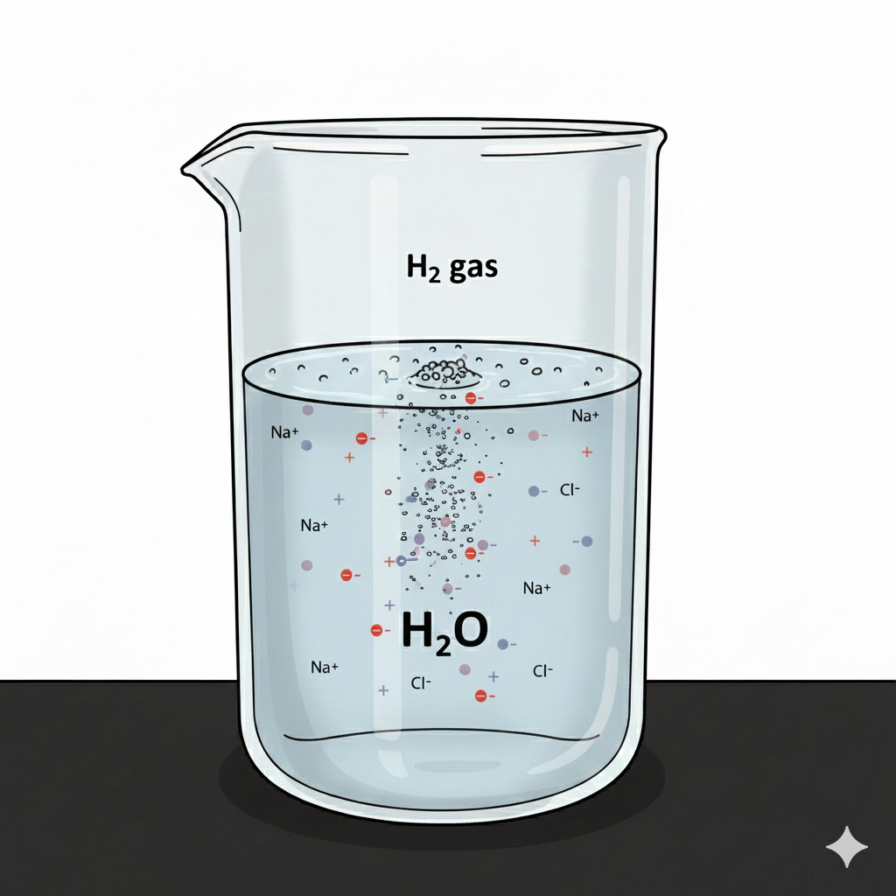

  

# Solubility_Hydrogen

This code is developed in Julia Programming Language and is to compute the extent of solubility of hydrogen in water and brine under varying conditions of pressure, temperature and salinity. The accuracy has been tested across existing experimental data. 
In addition, the code can be used to predict the solubility of other gases, including nitrogen (N₂), methane (CH₄), and carbon dioxide (CO₂). However, the accuracy of the model for these gases has not yet been systematically validated against experimental measurements.
The framework also supports gas mixtures, allowing the user to specify arbitrary combinations of these gases and compute their individual solubilities in aqueous and saline systems.

 If you are using this code please kindly consider citing the following paper:
 @article{GOLGHANDDASHTI2026139371,
title = {Hydrogen solubility in water and brine: A simplified Henry’s law method verified against experimental data},
journal = {Fuel},
volume = {424},
pages = {139371},
year = {2026},
issn = {0016-2361},
doi = {https://doi.org/10.1016/j.fuel.2026.139371},
url = {https://www.sciencedirect.com/science/article/pii/S0016236126011257},
author = {Hassan Golghanddashti and Mohammad Sayyafzadeh and Mark Bunch and Andrea Binda and Abbas Zeinijahromi},

To use this file you can use the following simple codes:
Units are : Temperature, K; Pressure, Pa; Salinity, ppm or mg/l

#########Include The code

include("Solubility.jl")

######Define the model

model=PR(["hydrogen","water"]; translation=PenelouxTranslation)

model=SRK(["hydrogen","water"]) 

model=GERG2008(["hydrogen","water"])

########## Compute the solubility

compute_solubility(model,[298.0], [1.0e6], [[0.5,0.5]]; Salinity=[100000])

##############

You can give arrays of conditions as well. The model is verified vs experimental data for Hydrogen solubility in water and brine.
